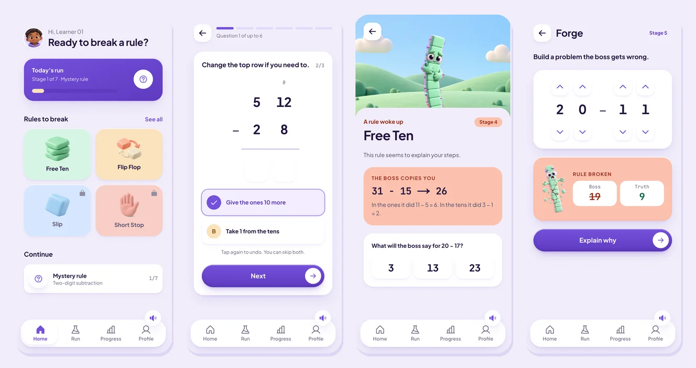
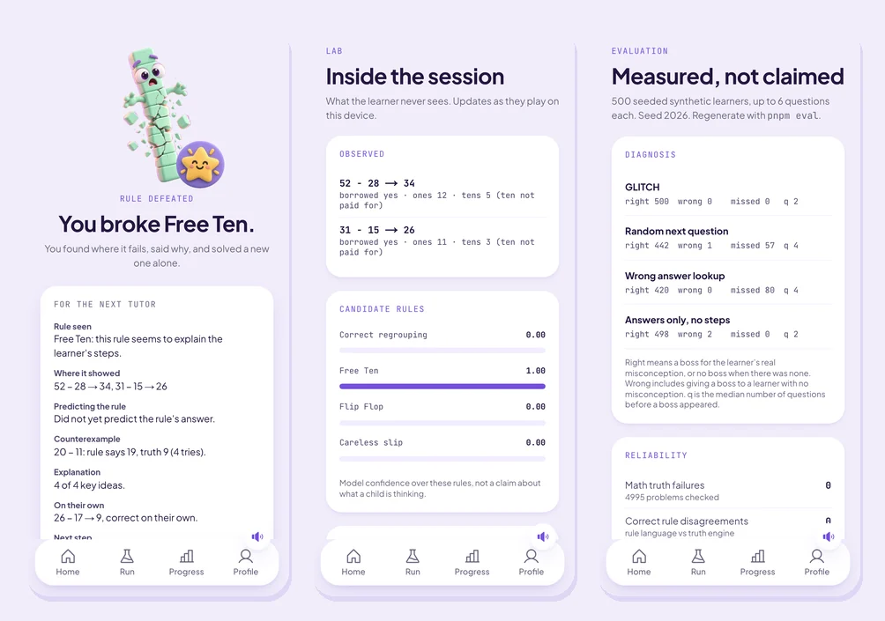

<div align="center">

# GLITCH

**Your mistake becomes the boss.**

A math game that works out the rule behind a child's wrong answers, turns that rule into an opponent, and lets them win only by proving it wrong.




</div>

## Contents

- [About](#about)
- [Features](#features)
- [How a run works](#how-a-run-works)
- [Screenshots](#screenshots)
- [Evaluation](#evaluation)
- [Tech stack](#tech-stack)
- [Getting started](#getting-started)
- [Scripts](#scripts)
- [Project structure](#project-structure)
- [Documentation](#documentation)

## About

Most learning software tells a learner that they are wrong. GLITCH asks a different question: _what rule would make this wrong answer look right?_

A child who answers 52 − 28 = 34 is not guessing. They borrowed a ten to make 12 ones and never took it from the tens. GLITCH watches every step, works out which rule explains them, and turns that rule into a boss called Free Ten. The child predicts what the boss will say, builds a problem it gets wrong, explains why it broke, and then solves a new problem on their own. Only then is the rule defeated.

The first domain is two-digit subtraction with regrouping, for learners aged 8 to 11.

## Features

- **Watches steps, not just answers.** Every borrow, rewritten digit and column answer is recorded.
- **Treats a wrong answer as a hypothesis.** It holds several candidate rules at once and asks the problem that best tells them apart.
- **Turns the rule into a boss.** The boss copies the learner's own work, and the learner predicts its next answer.
- **Makes winning take proof.** A counterexample, an explanation and an unseen problem solved alone.
- **Finds rules nobody wrote down.** When the known rules don't fit, an OpenAI model proposes new ones in a closed rule language, and a rule becomes a boss only if deterministic code confirms it.
- **Never lets a model decide what is true.** Arithmetic, rule execution, counterexamples and the victory condition are all deterministic.
- **Hands off to a tutor.** Every run ends with notes built from recorded evidence.
- **Built for children.** No chat, no ads, no accounts, no correctness shown mid-diagnosis, WCAG AA contrast, full keyboard use, reduced motion and a mute button on every screen.

## How a run works

| Stage          | What happens                                                                                         |
| -------------- | ---------------------------------------------------------------------------------------------------- |
| 1. Encounter   | The learner works a subtraction problem, step by step.                                               |
| 2. Observation | GLITCH records each step, not only the answer.                                                       |
| 3. Diagnostic  | Follow-up problems are chosen by expected information gain over the candidate rules.                 |
| 4. Boss        | A rule that clears the evidence gate becomes the boss, copies the learner, and is predicted by them. |
| 5. Forge       | The learner builds a problem, digit by digit, that the boss gets wrong.                              |
| 6. Explain     | The learner says why the boss broke, in their own words or by choosing ideas.                        |
| 7. Transfer    | The learner solves a new problem the rule would still get wrong.                                     |

A learner who regroups correctly throughout never gets a boss.

## Screenshots



`/judges` starts a guided run. `/lab` shows what the model believes during a session. `/eval` shows the measurements below.

## Evaluation

500 seeded synthetic learners, a quarter following each candidate rule, each allowed up to 6 questions. Every strategy faced the same learners.

| Strategy               | Right outcome | Wrong boss | Missed misconception | Median questions to boss |
| ---------------------- | ------------- | ---------- | -------------------- | ------------------------ |
| **GLITCH**             | 500 / 500     | 0          | 0                    | 2                        |
| Random next question   | 442 / 500     | 1          | 57                   | 4                        |
| Wrong-answer lookup    | 420 / 500     | 0          | 80                   | 4                        |
| Answers only, no steps | 498 / 500     | 2          | 0                    | 2                        |

These learners follow the rules the model already knows, so the scores show the machinery works, not accuracy with real children. Details in [EVAL.md](EVAL.md).

The model path is measured live with `pnpm eval:model` (gpt-5.5, 10 rule-finding runs, 9 labelled explanations):

| Model check                                                 | Result                  |
| ----------------------------------------------------------- | ----------------------- |
| Rule-finding output that parsed                             | 10 of 10 runs           |
| Proposed programs rejected by the validator                 | 0 of 19                 |
| Runs that found a rule passing verification                 | 10 of 10                |
| Runs whose rule matched the true rule on 90 unseen problems | 10 of 10                |
| Explanations judged as labelled                             | 8 of 9                  |
| Rule-finding latency                                        | 5.5 s median, 9.7 s P95 |
| Explanation latency                                         | 2.7 s median, 5.7 s P95 |

| Reliability check                | Result                  |
| -------------------------------- | ----------------------- |
| Arithmetic failures              | 0 across 4995 problems  |
| Malformed rule programs accepted | 0 of 15                 |
| False counterexamples            | 0 of 3240               |
| Stage order violations           | 0 across 60000 attempts |
| Choosing the next question       | 0.03 ms at P95          |

## Tech stack

| Area       | Choice                                                    |
| ---------- | --------------------------------------------------------- |
| Framework  | Next.js 16 (App Router), React 19                         |
| Language   | TypeScript 5.9, strict                                    |
| Styling    | Tailwind CSS 4 with a token system                        |
| State      | Zustand, persisted on the device                          |
| Validation | Zod                                                       |
| Model      | OpenAI `gpt-5.5` through the OpenAI SDK, server side only |
| Testing    | Vitest                                                    |

## Getting started

### Prerequisites

- Node.js 24
- pnpm 10

### Install and run

```bash
git clone https://github.com/Enoch208/glitch-learning.git
cd glitch-learning
pnpm install
pnpm dev
```

Open [http://localhost:3000](http://localhost:3000). The app is designed for phone width.

### Environment variables

The app runs fully without any configuration. To let the model propose new rules and read written explanations, create `.env.local`:

```bash
OPENAI_API_KEY=your-key
```

The key is read on the server only and never sent to the browser.

## Scripts

| Command                 | Description                                        |
| ----------------------- | -------------------------------------------------- |
| `pnpm dev`              | Start the development server                       |
| `pnpm build`            | Build for production                               |
| `pnpm start`            | Serve the production build                         |
| `pnpm test`             | Run the unit tests                                 |
| `pnpm test <path>`      | Run one test file or folder                        |
| `pnpm test -t "<name>"` | Run tests whose name matches                       |
| `pnpm eval`             | Regenerate `evals/results/diagnosis.json`          |
| `pnpm eval:model`       | Check the live model path (needs `OPENAI_API_KEY`) |
| `pnpm lint`             | Lint, including the no-comments rule               |
| `pnpm typecheck`        | Type-check                                         |
| `pnpm format`           | Format with Prettier                               |

## Project structure

```
src/
  app/            screens and the two API routes
  ai/             model calls, server side only
  components/     app shell, canvas, clay primitives
  events/         trace schema shared by canvas and engine
  engine/
    math/         truth engine for column subtraction
    rules/        rule language, interpreter, known rules, induction
    learner/      posterior, information gain, synthetic learners
    counterexample/  search and Forge evaluation
    game/         session, stage machine, transfer, tutor handoff
    eval/         baselines, reliability checks
  store/          run state
evals/            evaluation entry points and results
tests/            unit tests mirroring the engine
```

## Documentation

- [ARCHITECTURE.md](ARCHITECTURE.md): the engine, the rule language and the model boundary
- [EVAL.md](EVAL.md): how the evaluation is run and how to read it
- [KNOWN_LIMITS.md](KNOWN_LIMITS.md): what GLITCH does not do yet
- [SAFETY.md](SAFETY.md): design choices that protect children
- [THIRD_PARTY.md](THIRD_PARTY.md): dependencies and their licences
